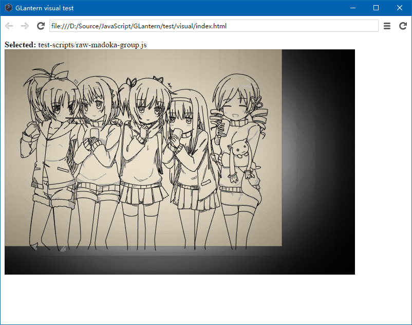

# GLantern

GLantern is a graphics library based on WebGL, providing a subset of
[Flash](http://www.adobe.com/software/flash/about/)-like API. Sound support will be added in the
future.



## Acquiring the Source

The repository is on [GitHub](http://github.com/Hozuki/GLantern/). You may want to use fine-tuned
[GitHub Desktop](//desktop.github.com/) (for Windows and Mac users), or `git` (for every OS) to
clone it into your computer:

```bash
$ git clone https://github.com/Hozuki/GLantern.git /preferred/cloning/destination
```

## Building from the Source

Make sure you have Node.js and NPM installed. The rest is quite simple:

```bash
$ cd /path/to/GLantern/
$ npm install
$ gulp build
```

After building, you will find:

- a `build/node` directory for NW.js and Electron (`var GLantern = require("glantern");`);
- a `build/GLantern-browser.js` file as the full, concatenated JavaScript file that can be placed
in browsers using the `<script>` tag;
- a `build/GLantern-browser.min.js` (and corresponding source mapping) as the minimized file for
better loading speed.

## Using the Library

See the demo page at `test/visual/index.html`. You will need an environment with WebGL, like
modern browsers, [NW.js](http://nwjs.io/), or [Electron](http://electron.atom.io/).

### Importing into Your Project

GLantern supports two styles of importing.

The first one is importing by `<script>` tag. Use its `src` attribute and point it to `GLantern-browser.min.js`
in the `build` directory:

```html
<script type="text/javascript" src="build/GLantern-browser.min.js"></script>
```

In environments that support Node.js, like NW.js or Electron, you can also use the `require` syntax:

```html
<script type="text/javascript">
    var GLantern = require("glantern");
</script>
```

After importing with either the former or the latter style, the `GLantern` object is globally available.

### Using Exported Members

The package structure of Flash is preserved in GLantern, so adding a `GLantern.` prefix usually
works. If you want to make it more like ActionScript, GLantern provides a `injectToGlobal()` function
to inject the "packages" to the global scope.

Either the first or the second style is accepted:

**Common code, used in both Style #1 and Style #2**

```javascript
var lantern = new GLantern.GLantern();
lantern.initialize(682, 438);
document.body.appendChild(lantern.view);
window.addEventListener("unload", function () {
    lantern.uninitialize();
});
```

**Style #1**

```javascript
var Display = Object.create({
    "createShape": function (alpha) {
        var s = new GLantern.flash.display.Shape(lantern.stage, lantern.stage);
        lantern.stage.addChild(s);
        s.alpha = alpha;
        return s;
    }
});
g = Display.createShape(1);
g.graphics.beginFill(0xffffff);
g.graphics.drawRect(0, 0, 540, 383);
g.graphics.endFill();
```

**Style #2**

```javascript
GLantern.injectToGlobal(this);
// And now GLantern members ("packages") are injected to the global scope.
var Display = Object.create({
    "createShape": function (alpha) {
        var s = new flash.display.Shape(lantern.stage, lantern.stage);
        lantern.stage.addChild(s);
        s.alpha = alpha;
        return s;
    }
});
g = Display.createShape(1);
g.graphics.beginFill(0xffffff);
g.graphics.drawRect(0, 0, 540, 383);
g.graphics.endFill();
```

## API References

<del>See [Wiki](//github.com/Hozuki/GLantern/wiki/).</del> (Not written yet.)

Visit the [ActionScript 3 API Reference](http://help.adobe.com/en_US/FlashPlatform/reference/actionscript/3/) instead.

## Q&A

### Why named "GLantern"?

To remark the relationship between the Green Lantern and the Flash (both from DC Comics).

`GLantern` is also a mocking of frequently used naming style in OpenGL, e.g. `GLenum`.
Not `GL_ENUM` but `GLenum`, weird, isn't it?

### Why aren't there any `module`s?

Using `module`s is a good approach on playing with TypeScript. But `modules` are designed to be
in one big file and I can't use them as C# namespaces, so I have to place them all in the root
scope, and `require()` them when needed. To generate a `.d.ts` definition, please do it yourself.

I had tried the syntax shown below:

```typescript
// ------- in Export.ts
export module Module {
    export default class Export {
        field:number = 0;
    }
}

// ------- in Import.ts
import Export from "./Export";

export module Module {
    export default class Import {
        static useSomeExports(exp:Export):void {
            console.log(exp);
        }
    }
}
```

But the compiler emitted lumps of error messages due to large number of classes.
I could not stand it anymore. Also, `interface`s and `enum`s can't be modified by `export default`.
`enum`s can be overcome using a trick (`export default SomeEnum;`), but `interface`s are hopeless
because of the ES6 standard and the implementation of TypeScript compiler.

As a conclusion, currently the best practice is to use some sort of manual indexing, like what
I did in this repo, a module-like organization and `export` approach, based on directories. Please
refer to the `index.ts` in each directory to see how it works.

## License

[The MIT License](//mitlicense.org)

You will also find a copy at [`LICENSE.md`](LICENSE.md).

## Other Resources

- Adobe Flash CC is able to export Flash project as WebGL projects. The tutorial and
restrictions can be found [here](https://helpx.adobe.com/flash/using/creating-publishing-webgl-document.html).
However, it has recently be announced that [Flash is replaced by Animate](http://blogs.adobe.com/flashpro/welcome-adobe-animate-cc-a-new-era-for-flash-professional/).
So fellas, you may want to give a warm welcome to that new solution.
- Mozilla has started a project, [Shumway](https://wiki.mozilla.org/Shumway), which is intended to
provide Flash-like support by using HTML 5 features on Firefox.
